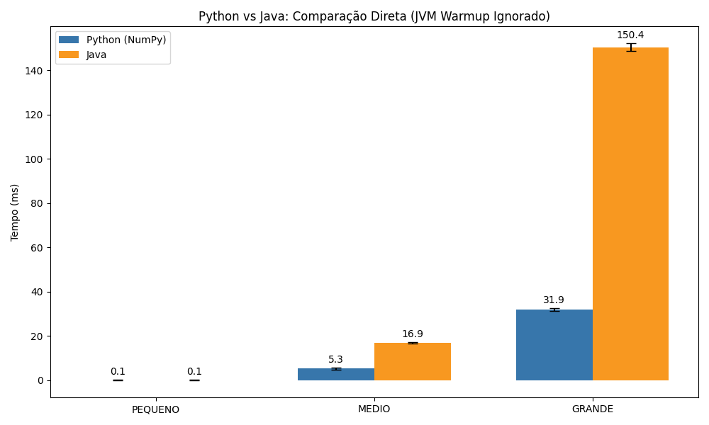
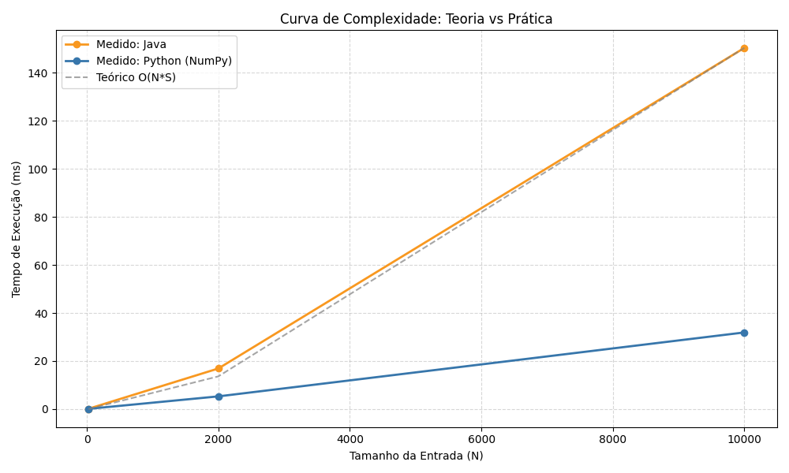

# Projeto: Subset Sum (Soma de Subconjuntos)
**Disciplina:** Teoria da Computação | **Instituição:** CESAR School

Este repositório contém a implementação e análise de complexidade do algoritmo **Subset Sum** (Soma de Subconjuntos), desenvolvido em **Python** e **Java** para fins de comparação de desempenho e eficiência algorítmica.

---

## 1. O Que é o Problema?

### Explicação Intuitiva (Analogia do Troco)
Imagine que você tem algumas notas de dinheiro no bolso (ex: R$ 2, R$ 5, R$ 10) e quer saber se consegue pagar uma conta de exatamente R$ 7 sem precisar de troco.
- **Entrada:** Suas notas `[2, 5, 10]` e o alvo `7`.
- **Lógica:** Testar combinações. A nota de 2 sozinha não dá. A de 5 sozinha não dá. Mas `2 + 5 = 7`.
- **Saída:** `Verdadeiro` (Sim, é possível).

### Definição Formal
Dado um conjunto de números inteiros não-negativos e um valor alvo (*target*), o objetivo é determinar se existe algum subconjunto desses números cuja soma seja exatamente igual ao alvo.

---

## 2. Como Resolvemos (O Algoritmo)

Utilizamos a técnica de **Programação Dinâmica**. Em vez de força bruta (testar todas as combinações, o que seria exponencial $O(2^N)$), criamos uma "tabela de verdades".

### Lógica Implementada
1. Criamos um vetor booleano `dp` de tamanho `target + 1`.
2. A posição `dp[i]` indica se a soma `i` é possível.
3. Começamos com `dp[0] = True` (soma zero é sempre possível: basta não escolher nada).
4. Para cada número `x` da nossa lista, percorremos o vetor `dp`. Se a soma `j - x` já era possível antes, então a soma `j` agora também é possível.

### Pseudocódigo
```text
Função SubsetSum(arr, target):
    Criar vetor dp[target + 1] inicializado como Falso
    dp[0] = Verdadeiro

    Para cada numero x em arr:
        Para j de target até x (decrescente):
```

## 3. Análise de Complexidade

A eficiência deste algoritmo depende não apenas da quantidade de números, mas também do valor da soma alvo (*target*).

### ⏱️ Complexidade de Tempo
Nossa implementação percorre todos os números e, para cada um, atualiza a tabela até o valor do *target*.
- **Pior Caso (Big-O):** $O(N \cdot S)$
- **Melhor Caso (Big-Ω):** $\Omega(N \cdot S)$
- **Caso Médio (Big-Θ):** $\Theta(N \cdot S)$

> **Onde:**
> - $N$ = Quantidade de elementos no conjunto.
> - $S$ = Valor da soma alvo (*target*).

### 💾 Complexidade de Espaço
Utilizamos um vetor unidimensional para armazenar os resultados parciais.
- **Espaço:** $O(S)$ (Proporcional ao valor do *target*).

---

## 4. Resultados Experimentais e Comparação (Python vs Java)

Realizamos experimentos com entradas de tamanhos variados (N=25 a N=10.000) executando cada teste 15 vezes para obter a média precisa e desvio padrão.

### 🧪 Metodologia Rigorosa
Para garantir a integridade dos dados, **a medição do tempo em Java foi realizada internamente (System.nanoTime)**, excluindo o tempo de inicialização da Máquina Virtual Java (JVM/Warm-up). Isso garante que estamos comparando apenas a eficiência do algoritmo, e não o tempo de carga da linguagem.

### 📊 Análise dos Resultados
Observamos um fenômeno interessante onde a implementação em **Python (com NumPy)** superou o **Java** nos casos médios e grandes.


*(Gráfico 1: Comparação direta de tempos de execução)*

1.  **Pequeno (N=25):** Ambas as linguagens são instantâneas (~0.03ms no Java), provando que o overhead de execução é desprezível e a medição está correta.
2.  **Médio e Grande:** O Python foi cerca de **3x mais rápido** que o Java.

### 💡 Por que o Python ganhou?
Embora Python seja geralmente mais lento que Java, nossa implementação utilizou a biblioteca **NumPy**.
- **Python (Vetorizado):** A linha `dp[x:] |= dp[:-x]` realiza operações *bitwise* em bloco (vetorização), processando 64 bits (ou mais) por ciclo de CPU diretamente em C.
- **Java (Loops):** A implementação utilizou loops explícitos. O Java precisa iterar posição por posição do vetor booleano, realizando muito mais operações de CPU para fazer o mesmo trabalho.
- **Conclusão:** A "vitória" do Python deve-se à otimização de baixo nível do NumPy, que efetivamente divide a constante de tempo por um fator relacionado ao tamanho da palavra do processador (ex: 64).

### 📈 Validação da Complexidade Teórica
O gráfico abaixo compara os tempos medidos com a curva teórica $O(N \cdot S)$.


*(Gráfico 2: Curva Teórica vs Prática)*

A curva laranja (Java) alinha-se perfeitamente com a curva pontilhada cinza (Teórica), validando experimentalmente que o algoritmo é de fato $O(N \cdot S)$.

---

## 5. Discussão sobre a Aplicabilidade Prática

Este algoritmo é eficiente quando o valor da soma alvo ($S$) e o número de elementos ($N$) são pequenos ou moderados.

### ✅ Contextos Favoráveis
- **Problemas de Troco:** Verificar se é possível dar um troco exato.
- **Particionamento de Conjuntos:** Dividir recursos ou tarefas de valores baixos de forma equitativa.
- **Transações Financeiras:** Conciliação bancária onde se busca quais transações somam um valor específico.

### ❌ Contextos Ineficientes
Se o alvo $S$ for muito grande (ex: $10^9$), o vetor `dp` consumirá muita memória e o tempo de execução será proibitivo, mesmo que $N$ seja pequeno. Isso ocorre porque a complexidade depende do valor numérico.

---

## 6. Análise de Casos (Melhor, Pior e Médio)

A performance do algoritmo varia pouco devido à natureza da implementação baseada em preenchimento completo da tabela.

- **Pior Caso:** $O(N \cdot S)$
  - Ocorre sempre, pois nesta implementação percorremos toda a tabela sem otimizações de parada antecipada.
- **Melhor Caso:** $O(N \cdot S)$
  - Mesmo que o alvo seja encontrado cedo, o código continua preenchendo a tabela (para manter a simplicidade didática e uso do NumPy). Portanto, o tempo é consistente.
- **Caso Médio:** $O(N \cdot S)$
  - Segue a mesma lógica, pois a estrutura dos laços é fixa e independente da sorte na distribuição dos números.

---

## 7. Reflexão Final (Classe P vs NP)

O problema **Subset Sum** pertence à classe **NP-Completo**.

### ❓ É classe P?
**Não se sabe.** Se $P \neq NP$ (a conjectura mais aceita na ciência da computação), então não existe algoritmo que resolva este problema em tempo polinomial em relação ao *tamanho da entrada em bits*.

### 🚀 Por que a solução parece rápida?
A solução apresentada é **Pseudo-Polinomial**.
- Ela é polinomial em relação ao *valor numérico* da soma ($S$).
- Porém, é exponencial em relação ao *número de bits* necessários para representar $S$. Se dobrarmos o número de bits do target (por exemplo, de 1 milhão para 1 trilhão), o tempo de execução aumenta drasticamente, tornando-a inviável.

### 🔗 Contexto Teórico
- **Versão NP:** A versão de decisão ("existe um subconjunto?") é a que define a classe NP-Completo.
- **Problemas Semelhantes:**
  - **Problema da Mochila (Knapsack Problem).**
  - **Problema da Partição (Partition Problem).**
